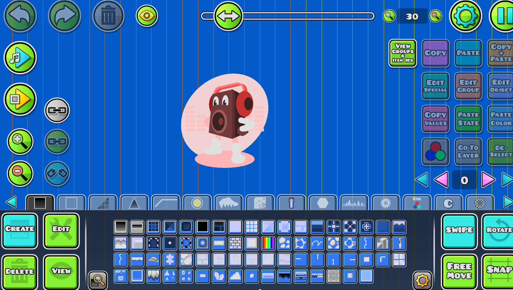
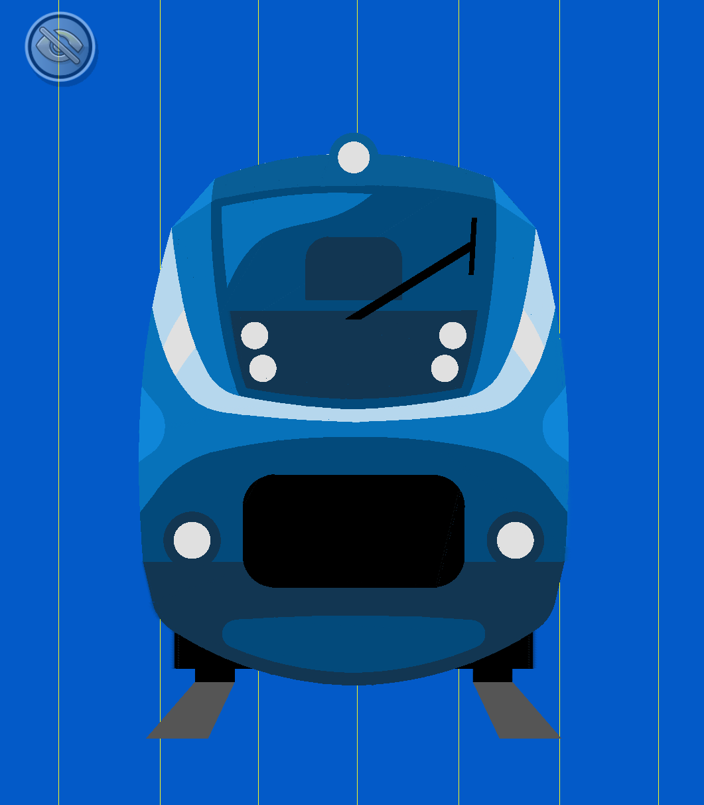

# SVG Converter

This is a Geometry Dash Mod made with [Geode SDK](https://github.com/geode-sdk/geode) that imports `.svg` files to the game as objects.
Special credit for Allium mod, the main reference for geometry functions that you can find in renderer.cpp

## Copyright notice

* [Geode SDK: BSL 1.0](https://github.com/geode-sdk/geode/blob/main/LICENSE.txt)
* [Allium: BSL 1.0](https://github.com/altalk23/Allium/blob/main/LICENSE.txt)
* [Nanosvg: zlib License](https://github.com/memononen/nanosvg/blob/master/LICENSE.txt)
* [earcut.hpp: ISC License](https://github.com/mapbox/earcut/blob/main/LICENSE)
* [Anti-Grain Geometry: 3-Clause BSD](https://github.com/ghaerr/agg-2.6/blob/master/README.md)
